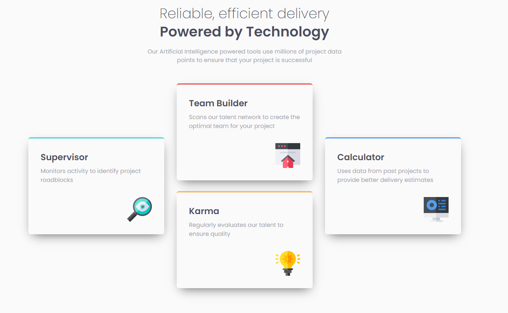

# Frontend Mentor - Four card feature section solution

This is a solution to the [Four card feature section challenge on Frontend Mentor](https://www.frontendmentor.io/challenges/four-card-feature-section-weK1eFYK). Frontend Mentor challenges help you improve your coding skills by building realistic projects.

## Overview

### Screenshot

### Links

- Solution URL: [https://www.frontendmentor.io/solutions/four-card-feature-section-5d1dYXxnKE](https://www.frontendmentor.io/solutions/four-card-feature-section-5d1dYXxnKE)
- Live Site URL: [https://geelloo.github.io/four-card-feature-section-master/](https://geelloo.github.io/four-card-feature-section-master/)

## My process

### Built with

- Semantic HTML5 markup
- CSS custom properties
- Flexbox
- Grid
- Mobile-first workflow

## Author

- Frontend Mentor - [@Geelloo](https://www.frontendmentor.io/profile/Geelloo)
